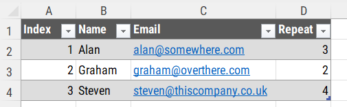
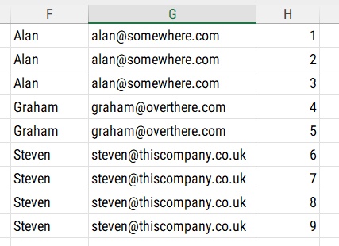

## Mastering Dynamic Spilled Arrays in Excel - The `REDUCE` function

Excel has added many powerful features in recent years, like dynamic spilled arrays. These allow for more flexible and efficient data manipulation. 

Today, I'll break down a complex formula that showcases the power of these new functions, in particular the `REDUCE` function. 

Let's start by looking at the formula we'll be dissecting:

```excel
=LET(
    arr, CHOOSECOLS(Table1, 2, 3, 4),
    DROP(
        HSTACK(
            REDUCE(
                {"", ""},
                SEQUENCE(ROWS(arr)),
                LAMBDA(_state, _current,
                    VSTACK(
                        _state,
                        IF(
                            SEQUENCE(INDEX(arr, _current, 3)),
                            INDEX(arr, _current, {1, 2})
                        )
                    )
                )
            ),
            SEQUENCE(SUM(INDEX(arr, , 3)) + 1, , 0)
        ),
        1
    )
)
```

This formula works with a table (Table1) containing four columns: Index, Name, Email, and Repeat. The goal is to create a new table that repeats each row based on the value in the Repeat column.




Let's break it down piece by piece:

1. `LET` Function:
   The LET function allows us to create named variables within the formula, making it more readable and efficient. Here, we're creating a variable called 'arr'.

2. `CHOOSECOLS` Function:
   ```excel
   arr, CHOOSECOLS(Table1, 2, 3, 4)
   ```
   This selects columns 2, 3, and 4 from Table1 (Name, Email, and Repeat), creating our 'arr' variable.

3. `DROP` Function:
   The outermost DROP function removes the first row of the final result, which I'll explain later.

4. `HSTACK` Function:
   HSTACK combines two arrays horizontally. In this case, it's combining our main data manipulation with a sequence of numbers.

5. `REDUCE` Function:
   This is the part of our formula that does the bulk of the work. REDUCE iterates over a sequence, applying a function to each element and accumulating the result. Let's break it down:

   ```excel
   REDUCE(
       {"", ""},
       SEQUENCE(ROWS(arr)),
       LAMBDA(_state, _current,
           VSTACK(
               _state,
               IF(
                   SEQUENCE(INDEX(arr, _current, 3)),
                   INDEX(arr, _current, {1, 2})
               )
           )
       )
   )
   ```

   - The initial value is `{"", ""}`, starting with an empty 1x2 array of one row and two columns. 
     - **Note** - Changing the comma separator in the array to a semi-colon would create one column with two rows. Here we leave it as one row with two columns
   - Iterate over `SEQUENCE(ROWS(arr))`, which creates a sequence from 1 to the number of rows in our 'arr' variable.
   - The `LAMBDA` function defines what happens in each iteration:
     - _state represents the accumulated result
     - _current represents the current value in the sequence

6. `VSTACK` Function:
   This function stacks arrays vertically. It's used to combine the previous state with the new rows we're adding.

7. `IF` and `SEQUENCE` Functions:
   ```excel
   IF(
       SEQUENCE(INDEX(arr, _current, 3)),
       INDEX(arr, _current, {1, 2})
   )
   ```
   This is where the magic happens. For each row:
   - We create a sequence based on the 'Repeat' value `(INDEX(arr, _current, 3))`.
   - If this sequence exists (i.e., Repeat > 0), we return the Name and Email `(INDEX(arr, _current, {1, 2}))`. 
   - The `{1,2}` in the last parameter of the `INDEX` function are columns indices from the original array. Changing the order to `{2, 1}` would swap the columns from the result shown below.
   - This effectively repeats each row the specified number of times.

8. `SEQUENCE` Function (outside `REDUCE`):
   ```excel
   SEQUENCE(SUM(INDEX(arr, , 3)) + 1, , 0)
   ```
   This creates a sequence starting from 0, with a length equal to the sum of all 'Repeat' values plus one. It's used to add an index column to our final result.

9. Final `DROP` Function:
   As mentioned earlier, this removes the first row of our result, which would be the initial {"", ""} we started with in the `REDUCE` function.

The end result, with the formula in cell F1, is a range of data that repeats each row from the original table based on the 'Repeat' value, with an added index column.



This formula showcases the power of dynamic spilled arrays and functions like `REDUCE`. It allows for complex data manipulations that would have been much more difficult or even impossible with older versions of Excel.

While it might seem confusing and intimidating at first, breaking it down step by step reveals the logic behind each part. The `REDUCE` function, in particular, is a powerful tool for iterating over data and accumulating results.

Complex formulas like this one are not built in one go. They're usually developed incrementally, testing each part before combining them into the final result. Don't be afraid to break them down, modify them, and see how changes affect the output. 

That's the best way to truly understand and leverage the power of dynamic spilled arrays in Excel.
